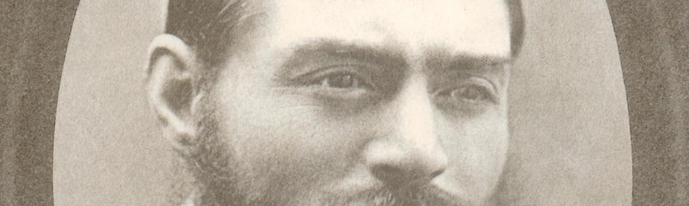
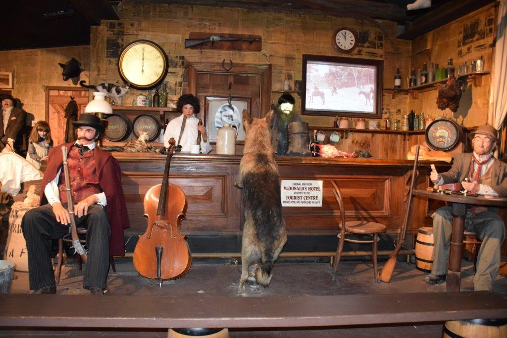

*Author's note: This story occurred before viruses kept us in our homes.* 

At the very real risk of sounding ancient, there is perhaps no more scournful a rage than that which I direct towards crowd-sourced reviews. Yelp, Google Reviews, TripAdvisor. It doesn't matter. Sure, it's stupid, entitled, often unjust, but more importantly, there's a world of entertainment out there passing us by because of the bold-faced charlatanism of your average man and woman on the street. To wit, I may have never witnessed the (2-star?!) animatronic splendor on display at Ned Kelly's Last Stand.

An hour's drive north of Melbourne is a town known as Glenrowan. Bizarrely, this tiny little dot from which the highway bends away is known by literally all Australians, and literally none of the rest of the world. It is, of course, the town in which some drunk criminal and his mates died in a gun battle with police in 1880. In all likelihood this incident would have been forgotten by everyone by 1881 were it not for the ridiculous makeshift armour with which they chose to protect themselves. In essence, it worked until it didn't, and now a sleepy village serves as eternal shrine to these assholes to this day, a century and a half later. 

In 2008, a young drunk named Corey Worthington also dressed in questionable attire and attracted police attention in a town that the highway ignores, but this writer would have no qualms should someone propose his being memorialised on stamps and tattoos and television. Corey was just having a rager. 

Ned Kelly's Last Stand stood out amongst its neighbours on the main street, not because of size or bright colours, but because its proprietor strode out into it as I parked my car to beckon me inside. His spiel was enthusiastic and perfectly delivered and for a moment I thought this might be the greatest animatronic doll I'd ever seen, and would gladly pay whatever amount it demanded of me to see more. After a few minutes of debating whether *thirty dollars* was too much, I handed over my card. The sign on the wall - A SHOW EVERY HALF HOUR - was informative and direct, but raised questions. Is Glenrowan large enough to sustain that sort of output? If not, just how strong is the town's cultural gravity that it can pull enough drivers from the highway to warrant such a frequency? 

The owner and his teenage grandson were exceedingly polite and welcoming to all customers, save for one gent who had the temerity to browse the memorabilia in the entry foyer before being kindly informed he had to pay for that privilege. City slicker. That would probably occur a lot, I thought, with that open door from the street.

Onwards my companion and I walked, into the cloud-machined Glenrowan street of yesteryear. Shouting voices and thunderous sound effects piped in from hidden speakers,  as we walked through rooms representing famous landmarks from the tale of Ned Kelly. The train station! The pub!  Heads jerked back and forth, limbs flailed, lasers pointed, and dogs peed. The animatronics were indeed, uh, animated and electronic. It was at times quite dark. It was always loud. My natural reaction to the street shootout - located outside in the now blinding sunlight of the property's rear yard - was great concern for what the neighbours might think of all this racket every half hour? 

I just as quickly rebuffed my own concerns by reasoning that anyone not wholly committed to Ned folklore has probably already moved to Wangaratta.

My companion, who had visited N.K.L.S as a child, gave a vivid recollection of being ushered, along with the other patrons, into a timber shed wherein the animatronic Kelly Gang sat holed-up and cornered by the surrounding police. She recalled her fear of this particular display that involved the ramshackle building being set alight. And informed me this would be our next location.

I will grant that the use of fire - in a wooden shack filled with wax, plastic and live humans - would, to the more cautious observer, appear dangerous. The confidence instilled in me by the owner's bellowing streetside speech, also, as you might expect, had already begun to wane. 
We nonetheless soldiered forth, resolute in our determination to disprove the Google Reviewers wrong. The owner had, afterall, created and maintained this production himself for over two decades, at the cost of millions, he claims. *Millions*. 

It was perhaps somewhat anticlimactic, then, that my visit revealed no fire - not a match, a spark, nothing - but instead a contraption of paper, cellophane, and a hidden wind generator. A brief enquiry after the tour ended, however, elicited a response from the owner that was at least as memorable as everything that had gone before. 

"We used to have real fire in there," he said. "But we went through a heatwave a few summers ago, and on the third or fourth day when we turned the fire on the shed went up like a tinder box with about fifty people inside.  

My eyebrows, I assure you, had never been so animated. 

"They all got out," he said, before adding ruefully, "but they made us switch to the fake stuff after that."

Just like a gaggle of tourists miming the aim of a rifle towards Dealey Plaza as the sixth floor of the Texas School Book Depository suddenly collapses beneath them, there's an odd kind of humour to be found, isn't there, in a theatrical display that nearly knocks off forty-five more people than the historical figure to whom it pays tribute?

Five stars.

